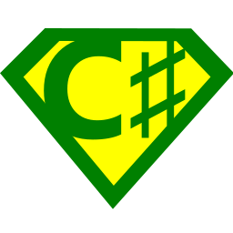
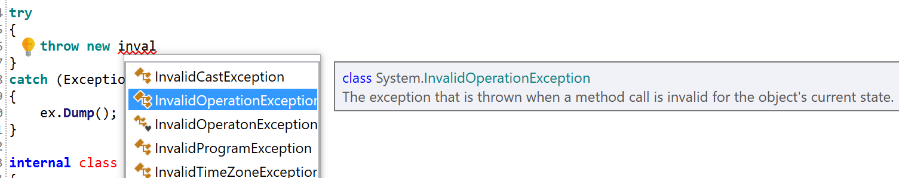
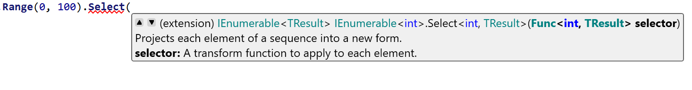
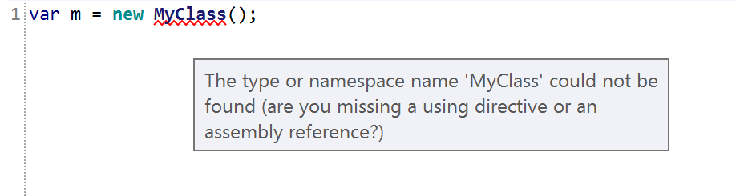
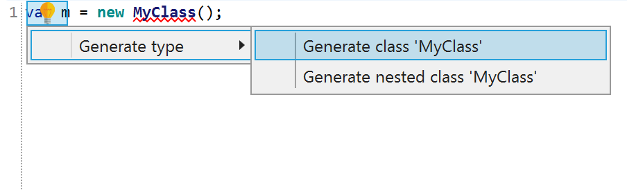

# RoslynPad

A cross-platform C# editor based on Roslyn and AvalonEdit

Also available to download in the Microsoft Store:

## Packages

RoslynPad is also available as NuGet packages which allow you to use Roslyn services and the editor in your own apps.

|Package Name|Description|
|------------|-----------|
| `RoslynPad.Roslyn`|Exposes many Roslyn editor services that are currently internal|
| `RoslynPad.Roslyn.Windows`|Provides platform-specific (WPF) implementations for UI elements required by the `RoslynPad.Roslyn` package|
|` RoslynPad.Roslyn.Avalonia`|Provides platform-specific (Avalonia) implementations for UI elements required by the `RoslynPad.Roslyn` package|
| `RoslynPad.Editor.Windows`|Provides a Roslyn-based code editor using AvaloniaEdit (WPF platform) with completion, diagnostics, and quick actions|
| `RoslynPad.Editor.Avalonia`|Provides a Roslyn-based code editor using AvalonEdit (Avalonia platform) with completion, diagnostics, and quick actions|

`RoslynPad.Roslyn*` package versions will correspond to Roslyn's.

[Code samples](https://github.com/aelij/RoslynPad/tree/master/samples)

## Building

Open `src\RoslynPad.sln` in Visual Studio 2019.

## Running the cross-platform .NET Core Avalonia version (on Mac or Linux)

* Install .NET Core Runtime 2.2
* Download and unzip `RoslynPadNetCore.zip`.
* Run `dotnet RoslynPad.dll`

## Features

### Completion

### Signature Help

### Diagnostics

### Code Fixes

