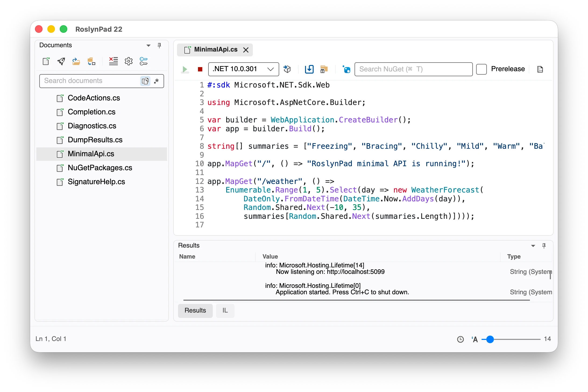
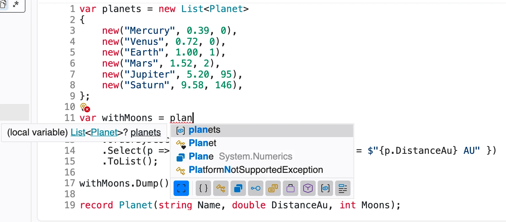
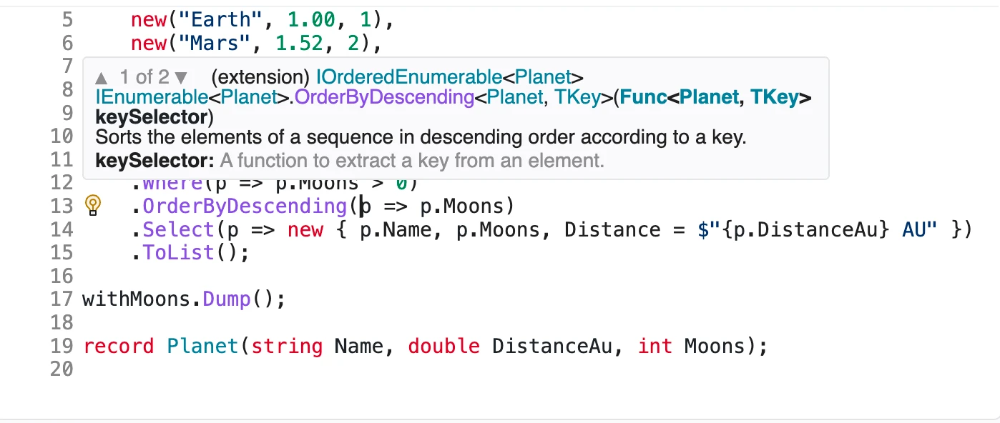
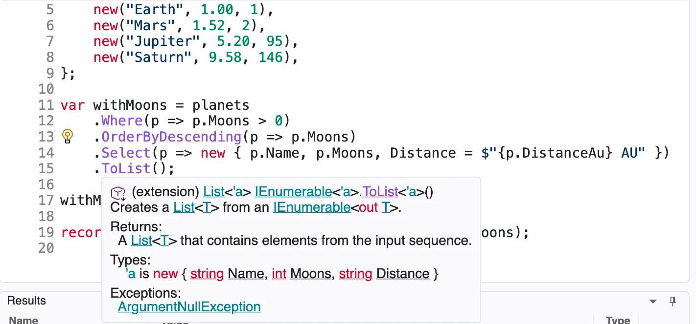
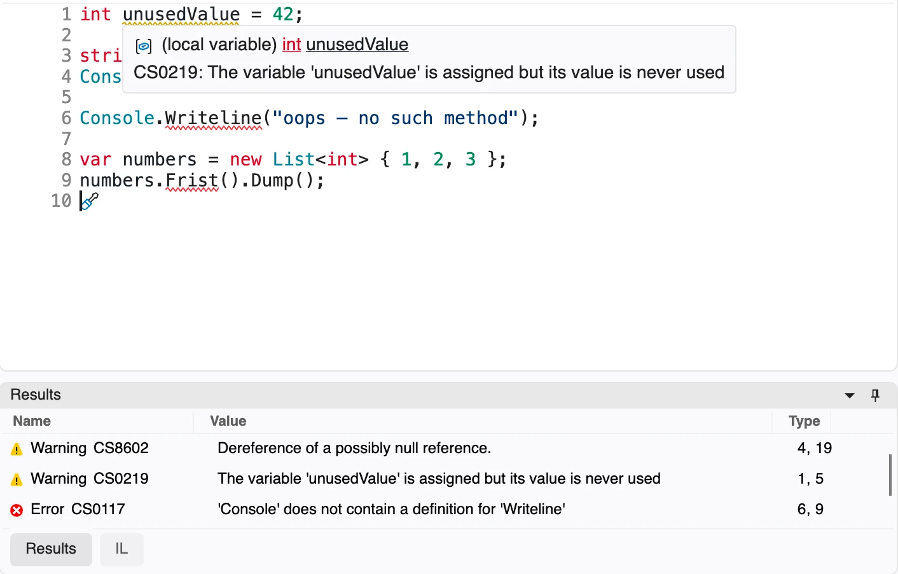
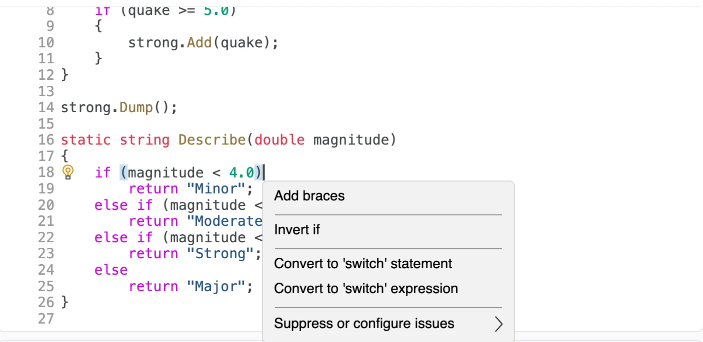
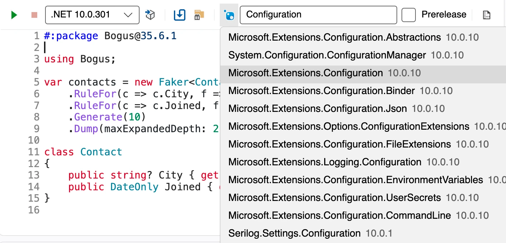
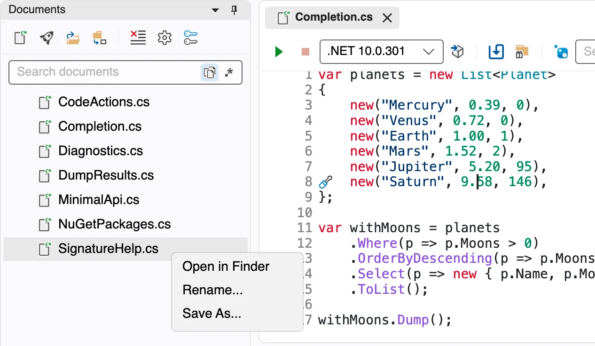
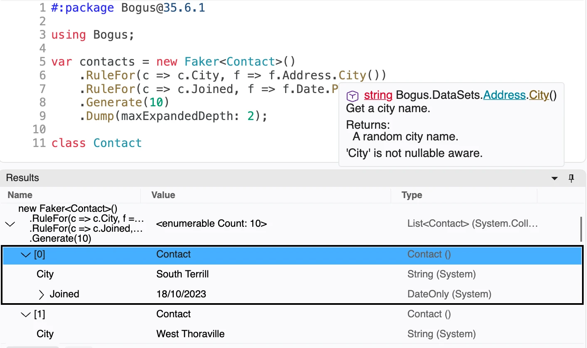

# RoslynPad

A cross-platform C# editor powered by Roslyn and the Morgania editor - an Avalonia editor based on the [vs-editor-api](https://github.com/microsoft/vs-editor-api) repo.

## Installing

**You must also install a supported [.NET SDK](https://aka.ms/dotnet) to allow RoslynPad to compile programs.**

| Source | |
|-|-|
| GitHub |  |
| Microsoft Store |  |
| winget | `winget install --id RoslynPad.RoslynPad` |
| Homebrew | `brew install --cask roslynpad` |

## Packages

See [Packages](docs/packages/README.md) for more information.

## Building

To build the source code, use one of the following:
* `dotnet build`
* Visual Studio Code with the C# extension
* Visual Studio 2026 (Windows only)

## Features

### Completion

### Signature Help

### Quick Info

### Diagnostics

### Code Fixes

### NuGet Packages

### Document Management

### Dump Results

